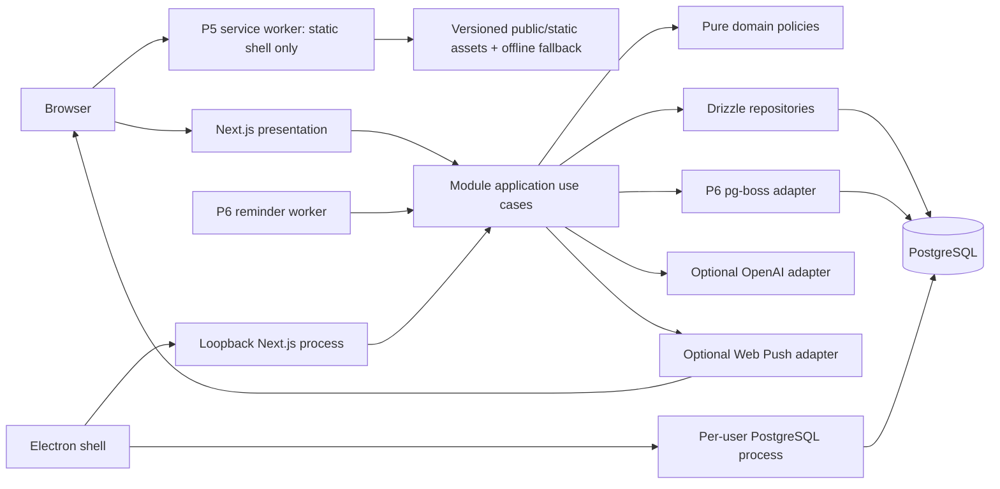

# Architecture contract

## System shape



This is the target Local-first Full Release topology. The product remains one modular TypeScript
application with a Next.js web process and PostgreSQL as the self-host baseline. The Electron shell
is a packaging and process-supervision boundary around that same process and database; it adds no
domain or API implementation. P5 adds only the browser installable static shell boundary. Through P5, the existing worker entry point remains a zero-job
architecture smoke; P6 alone activates it for notification jobs and Web Push delivery. OpenAI,
browser push support, VAPID configuration, and a running reminder worker are optional capabilities:
their absence must not prevent manual tasks, planning, recurrence, habits, Focus, export, or web
startup.

## Boundary model

Each feature under `modules/*` owns its domain, use cases, persistence definitions, and UI adapters.

```text
modules/tasks/
  domain/           entities, policies, value objects, pure tests
  application/      use cases, DTOs, authorization, transactions
  infrastructure/   Drizzle schema/repositories, provider adapters
  presentation/     feature components, hooks, query keys
    index.ts        public UI entry used by Next route composition
  index.ts          public application service API
```

Create only the layer directories a module needs. No layer may become a generic dumping ground.

### Dependency direction

- Presentation depends on application DTOs/use cases.
- Application depends on domain policies and infrastructure interfaces/implementations wired at composition roots.
- Domain depends only on TypeScript and other pure domain code inside the same module.
- Infrastructure can translate between external rows/payloads and application/domain contracts.
- Cross-module application coordination calls public module services; it never reaches into another module's repository.
- A root module `index.ts` may export application contracts only. It cannot re-export domain, presentation, or infrastructure code.
- Next route composition may import a module's exact `presentation/index.ts`; individual presentation files remain private to the module.

The small amount of dependency injection needed is explicit function parameters/factories. Do not add a DI container.

## Request and mutation flow

1. Route handler obtains an authoritative session through the identity module's public application
   surface; the returned actor/session contract is provider-neutral and owned by `shared/auth`.
2. Zod parses path/query/body data; client ownership claims are discarded.
3. Application use case loads authorized records through its repository.
4. Domain policy evaluates the mutation.
5. Application use case writes in one transaction and increments `version` exactly as the owning aggregate contract requires.
6. Presentation receives an application DTO, never a raw Drizzle row.

Stale mutation versions return a typed conflict response. Clients refetch the row and preserve unsaved input long enough to let the user retry; last-write-wins is not the default.

## Read projections

Smart lists, calendar events, agenda rows, and Eisenhower quadrants are projections. They do not own duplicate status/schedule data.

- Query application services accept a bounded filter/range and return view models.
- Counts and aggregates execute in PostgreSQL when practical.
- A projection may be cached in TanStack Query but PostgreSQL remains authoritative.
- Recurring task instances are expanded only for the requested finite range; recorded occurrence
  events are source state, not materialized task clones.
- Habit streaks/heat maps and Focus totals are derived from their canonical logs/sessions; counters
  and summary rows are not stored.
- Do not create materialized projection tables during the Local-first Full Release.

## Time model

Time is a product invariant, not a formatting detail.

- Timed schedules persist UTC instants plus an IANA timezone describing user intent.
- All-day schedules persist local `date` values, never midnight UTC stand-ins.
- A task schedule is either all-day or timed; database constraints prevent mixed representations.
- A task's derived due boundary is timed `end_at`, or the exclusive all-day `end_date` interpreted at midnight in the user's saved IANA timezone. Matrix/overdue queries compute it; no `due_at` or deadline duplicate is stored.
- Smart-list boundaries use the user's saved timezone.
- Presentation formatting uses the user's week start and hour-cycle preferences.
- Recurrence is anchored to the canonical all-day or timed task schedule and expands to deterministic
  occurrence identities inside a caller-supplied bounded range.
- Habit check-ins persist a local `date` interpreted in the habit's stored IANA timezone. Focus and
  explicitly started break duration are reconstructed from server timestamps and accumulated active
  seconds, not client ticks. Break rows never contribute to focus totals.
- Absolute reminders persist an instant. Relative reminders derive their next instant from an
  eligible task or occurrence start; they do not add a second schedule field.

Domain tests must cover spring-forward/fall-back behavior for at least one representative IANA zone.

## Active release extension boundaries

- `modules/tasks` owns task recurrence rules, append-only occurrence events, deterministic occurrence
  identity, and range-bounded expansion. `modules/planning` consumes only the public bounded
  occurrence projection and never stores recurrence state.
- `modules/habits` owns habit definitions, schedules, local-day logs, and derived streak/heat-map
  projections. Other modules consume narrow public ownership/snapshot contracts.
- `modules/focus` owns authoritative active and completed focus/break session state. It accepts only
  narrow public task/habit ownership validators; break rows have no item link, and the module never
  persists client countdown ticks or derived totals.
- `modules/notifications` owns the one-task-reminder policy, push subscriptions, delivery records,
  provider adapter, and reminder worker use cases. Task changes call its injected public reconciler;
  notifications never write task schedule, recurrence, or status tables.
- PWA manifest, registration, update state, and content-free offline fallback are presentation/static
  infrastructure, not a domain module or a synchronization layer.
- `electron/` owns desktop process supervision, window security, runtime discovery, and packaging
  composition. It may start the existing Next.js server and PostgreSQL runtime only through explicit
  process boundaries; it may not import Drizzle repositories, feature application services, or React
  components.
- The Electron main process is ESM, while the sandboxed preload is deliberately compiled as CommonJS
  `.cjs`; sandboxed preloads do not execute in an ESM context. The preload exposes only the minimal
  context-isolated desktop marker.
- Desktop local writes are ordinary authenticated application writes to the per-user local database.
  They are not queued, replicated, or merged with another device.

These boundaries authorize only the capabilities listed in `docs/SCOPE.md`. Stage A-D remain later
roadmap context and contribute no dormant route, table, provider, or framework to this release.

## AI planner architecture

The assistant is a proposal pipeline, not an autonomous agent.

```mermaid
flowchart LR
    INPUT["Brain dump + selected task IDs + constraints"] --> LOAD["Authorize and load minimal context"]
    LOAD --> MODEL["GPT-5.6 Structured Output"]
    MODEL --> VALIDATE["Zod + semantic validation"]
    VALIDATE --> SCHEDULE["Deterministic free-interval scheduler"]
    SCHEDULE --> PROPOSAL["Persist versioned proposal"]
    PROPOSAL --> REVIEW["User edits/selects diff"]
    REVIEW --> APPLY["Revalidate current versions and atomic apply"]
```



Hard rules:

- `store: false` on Responses API requests.
- No browser-side OpenAI key or direct OpenAI call.
- No raw model output becomes a repository command.
- Model fields are semantic suggestions, never trusted database identifiers.
- Deterministic code owns overlap, work-window, timezone, version, authorization, and allowed-action rules.
- Proposal payload has `schemaVersion`, prompt/model metadata, expiry, and an idempotent apply token.
- The user sees uncertainties and overflow; the system does not fabricate resolution.

The release uses Structured Outputs because OpenAI documents schema adherence and native Zod SDK helpers, while still handling explicit refusals and semantic mistakes. See `docs/modules/assistant.md`.

## Authentication and authorization

- Better Auth owns credential/session mechanics.
- Each user receives a personal Inbox and preferences during account bootstrap.
- Application use cases own domain authorization; route protection alone is insufficient.
- A regular list is currently owner-only. Future list membership is a later migration and must not be preimplemented as dormant UI.
- Every query constrains owner/user IDs in SQL rather than loading first and filtering in memory.
- Export enumerates records through the same authorized module query surfaces, including the
  released recurrence, habit, completed focus-only, and portable reminder records. Break rows,
  subscription secrets, delivery records, and queue internals are never portable data.

## Reminder worker and provider boundary

P6 is the only package that activates background product behavior.

1. An authorized task/reminder mutation reconciles the next eligible logical delivery through the
   notifications module in the owning database transaction.
2. The transaction records an idempotent pg-boss job containing opaque identifiers and occurrence
   identity only; it contains no task content, endpoint, or key material.
3. The worker reloads current authorized reminder, task/occurrence, and subscription state before
   sending. Already delivered, stale, completed, deleted, disabled, or rescheduled work is a no-op.
4. The provider adapter decrypts subscription material only for delivery, applies bounded retry or
   permanent revocation policy, and never exposes provider payloads to presentation code.

Before P6 lands, `pnpm worker` remains the existing queue boot/shutdown smoke and no product contract
may depend on it. After P6, the final self-host topology runs the worker for reminders, while a
missing worker or VAPID/provider configuration is reported as an honest degraded capability rather
than a failure of the rest of the product.

The web capability endpoint reports configured, unconfigured, and known-disabled worker
configuration. It does not use a heartbeat table or claim that a configured process is currently
alive. Unexpected worker death is an operator concern detected by the worker check/readiness log and
process supervision; the UI says liveness is not verified rather than showing a false healthy state.

## Browser, PWA, and offline boundary

P5 adds an installable web manifest, original icons, and one small versioned service worker. Its
cache boundary is limited to fingerprinted public/static application assets and a dedicated
content-free offline fallback.

- When the running page detects lost connectivity or a network failure, keep already rendered data visible as stale and disable domain mutations with clear feedback.
- Do not cache authenticated HTML, API responses, task/planner/export data, provider responses, or
  any user-authored content in Cache Storage or IndexedDB.
- Do not queue writes, register background sync for domain mutations, or describe read-only rendered
  state as synchronized.
- A cold offline navigation may open only the static fallback shell; it must not imply that protected
  user data was loaded.
- Full offline writes require the Stage D sync protocol, tombstones, idempotency, and conflict UX;
  Stage D is outside this goal and must not be simulated with local-only state.

## Observability

- Pino JSON logs include request ID, route/use-case name, duration, status class, and opaque entity IDs only where useful.
- Redaction covers cookies, auth headers, OpenAI keys, request bodies, task content, and planner input/output.
- `/api/health/live` checks process liveness; `/api/health/ready` checks database connectivity and migration compatibility.
- No third-party behavioral analytics in active scope.

## Error contract

Application errors map to stable codes: `UNAUTHENTICATED`, `FORBIDDEN`, `NOT_FOUND`, `VALIDATION_FAILED`, `CONFLICT`, `RATE_LIMITED`, `PROVIDER_UNAVAILABLE`, and `INTERNAL`.

- User-facing messages are helpful but do not leak SQL/provider details.
- Unexpected errors carry a correlation ID.
- A stale-version `CONFLICT` may include only the safe current row version as response metadata;
  conflicts never expose another user's record or content.
- Optimistic UI rolls back on failure and offers retry.
- Provider failures do not corrupt domain transactions.

## Scaling path

This architecture scales without premature infrastructure:

1. Add read replicas/connection pooling only after measurement.
2. Move large attachment bytes to S3-compatible storage behind a provider adapter.
3. Add collaboration through list membership/activity modules and bounded polling or realtime adapter.
4. Add offline sync using row versions, tombstones, idempotency, and a change feed.
5. Split a module into a service only when independent scaling/ownership justifies the network boundary.

Do not introduce a monorepo, microservices, Redis, event bus, or generic plugin system merely for possible future scale.

## Architectural completion audit

Before sign-off, confirm:

- no presentation-to-Drizzle import;
- no domain framework import;
- no cross-module deep import;
- every mutation is ownership-scoped and transactionally correct;
- time semantics use the canonical schedule model;
- recurrence, habit, Focus, reminder, and PWA projections store no duplicate domain facts;
- authenticated user data is absent from service-worker caches and offline writes are impossible;
- the worker has no product job before P6 and owns only notification jobs after activation;
- no optional OpenAI or Web Push provider is required for web/manual product startup;
- schema and module docs match implementation;
- `docs/MANIFEST.md` reflects any approved boundary change.
