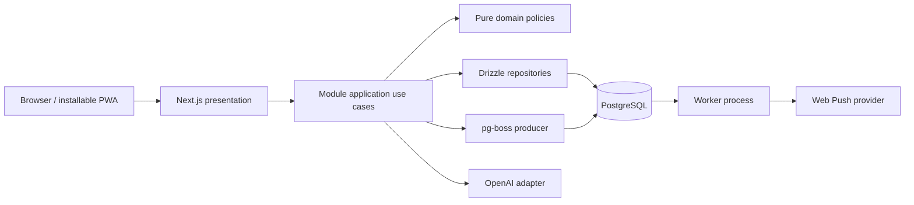

# Architecture contract

## System shape



The web and worker are two processes built from one repository and one module graph. PostgreSQL is the only required stateful service. OpenAI and web push are optional adapters; core task behavior remains available when either is absent.

## Boundary model

Each feature under `modules/*` owns its domain, use cases, persistence definitions, and UI adapters.

```text
modules/tasks/
  domain/           entities, policies, value objects, pure tests
  application/      use cases, DTOs, authorization, transactions
  infrastructure/   Drizzle schema/repositories, provider adapters
  presentation/     feature components, hooks, query keys
    index.ts        public UI entry used by Next route composition
  index.ts          public application service API
```

Create only the layer directories a module needs. No layer may become a generic dumping ground.

### Dependency direction

- Presentation depends on application DTOs/use cases.
- Application depends on domain policies and infrastructure interfaces/implementations wired at composition roots.
- Domain depends only on TypeScript and other pure domain code inside the same module.
- Infrastructure can translate between external rows/payloads and application/domain contracts.
- Cross-module application coordination calls public module services; it never reaches into another module's repository.
- A root module `index.ts` may export application contracts only. It cannot re-export domain, presentation, or infrastructure code.
- Next route composition may import a module's exact `presentation/index.ts`; individual presentation files remain private to the module.

The small amount of dependency injection needed is explicit function parameters/factories. Do not add a DI container.

## Request and mutation flow

1. Route handler obtains an authoritative session through the identity module's public application
   surface; the returned actor/session contract is provider-neutral and owned by `shared/auth`.
2. Zod parses path/query/body data; client ownership claims are discarded.
3. Application use case loads authorized records through its repository.
4. Domain policy evaluates the mutation.
5. Application use case writes in one transaction, increments `version`, and enqueues any job/outbox record needed.
6. Presentation receives an application DTO, never a raw Drizzle row.

Stale mutation versions return a typed conflict response. Clients refetch the row and preserve unsaved input long enough to let the user retry; last-write-wins is not the default.

## Read projections

Smart lists, calendar events, agenda rows, Eisenhower quadrants, Today habits, and statistics are projections. They do not own duplicate status/schedule data.

- Query application services accept a bounded filter/range and return view models.
- Calendar recurrence expands only inside the requested date window.
- Counts and aggregates execute in PostgreSQL when practical.
- A projection may be cached in TanStack Query but PostgreSQL remains authoritative.
- Do not create materialized projection tables during the hackathon release.

## Time model

Time is a product invariant, not a formatting detail.

- Timed schedules persist UTC instants plus an IANA timezone describing user intent.
- All-day schedules persist local `date` values, never midnight UTC stand-ins.
- A task schedule is either all-day or timed; database constraints prevent mixed representations.
- A task's derived due boundary is timed `end_at`, or the exclusive all-day `end_date` interpreted at local midnight. Matrix/overdue queries compute it; no `due_at` or deadline duplicate is stored.
- Smart-list boundaries use the user's saved timezone.
- Recurrence expands in the recurrence timezone and converts occurrences to instants only after local-rule evaluation.
- Focus durations derive from server timestamps, not client countdown ticks.
- Presentation formatting uses the user's week start and hour-cycle preferences.

Domain tests must cover spring-forward/fall-back behavior for at least one representative IANA zone.

## Recurrence model

The series definition belongs to the task; occurrence state belongs to a separate occurrence-exception table.

- RRULE is an infrastructure serialization, wrapped by a domain recurrence value object.
- Only rules listed in active scope can be created through the release UI/API.
- Completing, skipping, or overriding the current occurrence writes an exception keyed by series task and recurrence ID/local occurrence.
- Editing the series changes future expansion; past occurrence exceptions remain historical.
- Range queries expand rules and overlay exceptions.
- The reminder worker schedules only the next eligible occurrence in active scope and idempotently advances after completion/delivery.

## Reminder/job reliability

- Application writes the task/reminder change and pg-boss job in the same database transaction where supported.
- Each logical delivery has a deterministic idempotency key.
- The worker re-loads the reminder and authorized task state before sending; job payloads contain IDs, not task content.
- Deleted/completed/rescheduled tasks make obsolete jobs no-op.
- Delivery attempts record channel, state, provider response class, and timestamps; never endpoint/auth secrets or task content.
- Retry transient failures with bounded exponential backoff. Permanent subscription failures disable that subscription.

## AI planner architecture

The assistant is a proposal pipeline, not an autonomous agent.

```mermaid
flowchart LR
    INPUT["Brain dump + selected task IDs + constraints"] --> LOAD["Authorize and load minimal context"]
    LOAD --> MODEL["GPT-5.6 Structured Output"]
    MODEL --> VALIDATE["Zod + semantic validation"]
    VALIDATE --> SCHEDULE["Deterministic free-interval scheduler"]
    SCHEDULE --> PROPOSAL["Persist versioned proposal"]
    PROPOSAL --> REVIEW["User edits/selects diff"]
    REVIEW --> APPLY["Revalidate current versions and atomic apply"]
```



Hard rules:

- `store: false` on Responses API requests.
- No browser-side OpenAI key or direct OpenAI call.
- No raw model output becomes a repository command.
- Model fields are semantic suggestions, never trusted database identifiers.
- Deterministic code owns overlap, work-window, timezone, version, authorization, and allowed-action rules.
- Proposal payload has `schemaVersion`, prompt/model metadata, expiry, and an idempotent apply token.
- The user sees uncertainties and overflow; the system does not fabricate resolution.

The release uses Structured Outputs because OpenAI documents schema adherence and native Zod SDK helpers, while still handling explicit refusals and semantic mistakes. See `docs/modules/assistant.md`.

## Authentication and authorization

- Better Auth owns credential/session mechanics.
- Each user receives a personal Inbox and preferences during account bootstrap.
- Application use cases own domain authorization; route protection alone is insufficient.
- A regular list is currently owner-only. Future list membership is a later migration and must not be preimplemented as dormant UI.
- Every query constrains owner/user IDs in SQL rather than loading first and filtering in memory.
- Export enumerates records through the same authorized module query surfaces.

## PWA and offline boundary

The release service worker provides installability, static/app-shell caching, and push handling. It is not an offline sync engine.

- Cache only versioned public assets and explicitly safe GET responses.
- Never cache auth responses, OpenAI responses, exports, or arbitrary mutation responses.
- When offline, show previously rendered/cache-safe UI where available and disable domain mutations with clear feedback.
- Full offline writes require the Stage D sync protocol, tombstones, idempotency, and conflict UX; do not simulate them with local-only state now.

## Observability

- Pino JSON logs include request/job ID, route/use-case name, duration, status class, and opaque entity IDs only where useful.
- Redaction covers cookies, auth headers, OpenAI keys, VAPID keys, push endpoints, request bodies, task content, and planner input/output.
- `/api/health/live` checks process liveness; `/api/health/ready` checks database connectivity and migration compatibility.
- Worker emits queue lag, success/failure class, and retry counts to logs.
- No third-party behavioral analytics in active scope.

## Error contract

Application errors map to stable codes: `UNAUTHENTICATED`, `FORBIDDEN`, `NOT_FOUND`, `VALIDATION_FAILED`, `CONFLICT`, `RATE_LIMITED`, `PROVIDER_UNAVAILABLE`, and `INTERNAL`.

- User-facing messages are helpful but do not leak SQL/provider details.
- Unexpected errors carry a correlation ID.
- Optimistic UI rolls back on failure and offers retry.
- Provider failures do not corrupt domain transactions.

## Scaling path

This architecture scales without premature infrastructure:

1. Add read replicas/connection pooling only after measurement.
2. Move large attachment bytes to S3-compatible storage behind a provider adapter.
3. Add collaboration through list membership/activity modules and bounded polling or realtime adapter.
4. Add offline sync using row versions, tombstones, idempotency, and a change feed.
5. Split a module into a service only when independent scaling/ownership justifies the network boundary.

Do not introduce a monorepo, microservices, Redis, event bus, or generic plugin system merely for possible future scale.

## Architectural completion audit

Before sign-off, confirm:

- no presentation-to-Drizzle import;
- no domain framework import;
- no cross-module deep import;
- every mutation is ownership-scoped and transactionally correct;
- time semantics use the canonical schedule model;
- no optional provider is required for core app startup;
- schema and module docs match implementation;
- `docs/MANIFEST.md` reflects any approved boundary change.
