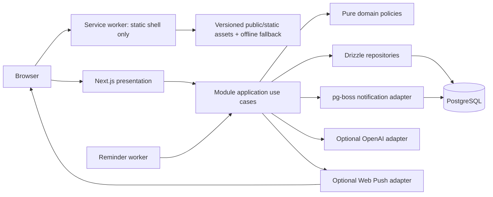

# Architecture contract

## System shape



This is the implemented Local-first Full Release topology. The product is one modular TypeScript
application with a Next.js web process, a two-queue reminder worker, and PostgreSQL as the self-host
baseline. The service worker provides only the installable static-shell boundary; the background
worker owns notification delivery and maintenance jobs only. OpenAI, browser push support, VAPID
configuration, and a running reminder worker are optional capabilities: their absence must not
prevent manual tasks, planning, recurrence, habits, Focus, export, or web startup.

## Boundary model

Each feature under `modules/*` owns its domain, use cases, persistence definitions, and UI adapters.

```text
modules/tasks/
  domain/           entities, policies, value objects, pure tests
  application/      use cases, DTOs, authorization, transactions
  infrastructure/   Drizzle schema/repositories, provider adapters
  presentation/     feature components, hooks, query keys
    index.ts        public UI entry used by Next route composition
  index.ts          public application service API
```

Create only the layer directories a module needs. No layer may become a generic dumping ground.

### Dependency direction

- Presentation depends on application DTOs/use cases.
- Application depends on domain policies and infrastructure interfaces/implementations wired at composition roots.
- Domain depends only on TypeScript and other pure domain code inside the same module.
- Infrastructure can translate between external rows/payloads and application/domain contracts.
- Cross-module application coordination calls public module services; it never reaches into another module's repository.
- A root module `index.ts` may export application contracts only. It cannot re-export domain, presentation, or infrastructure code.
- Next route composition may import a module's exact `presentation/index.ts`; individual presentation files remain private to the module.

The small amount of dependency injection needed is explicit function parameters/factories. Do not add a DI container.

Web release wiring lives in the checked `server/` composition root. It may import only public
`modules/*/index.ts` application factories; it cannot reach module internals or shared database
surfaces. The separately executed `worker/` composes the same public module contracts directly and
must not import the web composition root.

## Request and mutation flow

1. Route handler obtains an authoritative session through the identity module's public application
   surface; the returned actor/session contract is provider-neutral and owned by `shared/auth`.
2. Zod parses path/query/body data; client ownership claims are discarded.
3. Application use case loads authorized records through its repository.
4. Domain policy evaluates the mutation.
5. Application use case writes in one transaction and increments `version` exactly as the owning aggregate contract requires.
6. Presentation receives an application DTO, never a raw Drizzle row.

Stale mutation versions return a typed conflict response. Clients refetch the row and preserve unsaved input long enough to let the user retry; last-write-wins is not the default.

## Read projections

Smart lists, calendar events, agenda rows, and Eisenhower quadrants are projections. They do not own duplicate status/schedule data.

- Query application services accept a bounded filter/range and return view models.
- Counts and aggregates execute in PostgreSQL when practical.
- A projection may be cached in TanStack Query but PostgreSQL remains authoritative.
- Recurring task instances are expanded only for the requested finite range; recorded occurrence
  events are source state, not materialized task clones.
- Habit streaks/heat maps and Focus totals are derived from their canonical logs/sessions; counters
  and summary rows are not stored.
- Habit collection projections use actor-scoped keyset pages, not offset or unbounded array reads.
  Each opaque cursor is bound to one projection scope and lifecycle and its exact anchor is
  revalidated inside the page's repeatable-read snapshot. Lifetime habit logs are consumed in
  fixed-size repository pages by a constant-state streak reducer; finite history and month views use
  explicit local-date ranges. A page boundary never truncates the derived streak.
- Do not create materialized projection tables during the Local-first Full Release.

### Client route freshness

Authenticated server-rendered workspace pages remain dynamic and PostgreSQL-authoritative. After a
successful task, schedule, planner-apply, or date/time-preference mutation, presentation adapters
invalidate affected TanStack Query data and increment one workspace-route revision. A projection
route also refreshes its current React Server Component payload when the just-completed command can
change the visible projection. The shared authenticated shell consumes that revision at most once
per route key as normal pathname transitions or browser-history navigation revisit cached payloads.
Its per-route bookkeeping is bounded; an evicted route may conservatively refresh again rather than
revive stale data. A later revision makes each revisited route eligible once again. Browser Back
checks the current revision and refreshes stale payloads during history navigation.

This is a presentation cache-invalidation contract, not a second data store or offline protocol.
Unknown write outcomes retain the user's command/draft, describe the result as unconfirmed, and load
authoritative server state before claiming whether the change applied.

## Time model

Time is a product invariant, not a formatting detail.

- Timed schedules persist UTC instants plus an IANA timezone describing user intent.
- All-day schedules persist local `date` values, never midnight UTC stand-ins.
- A task schedule is either all-day or timed; database constraints prevent mixed representations.
- A task's derived due boundary is timed `end_at`, or the exclusive all-day `end_date` interpreted at midnight in the user's saved IANA timezone. Matrix/overdue queries compute it; no `due_at` or deadline duplicate is stored.
- Smart-list boundaries use the user's saved timezone.
- Presentation formatting uses the user's week start and hour-cycle preferences.
- Recurrence is anchored to the canonical all-day or timed task schedule and expands to deterministic
  occurrence identities inside a caller-supplied bounded range.
- Habit check-ins persist a local `date` interpreted in the habit's stored IANA timezone. Focus and
  explicitly started break duration are reconstructed from server timestamps and accumulated active
  seconds, not client ticks. Break rows never contribute to focus totals.
- Absolute reminders persist an instant. Relative reminders derive their next instant from an
  eligible task or occurrence start; they do not add a second schedule field. Timed one-offs use
  `start_at`; timed recurring tasks use the projected occurrence start; all-day recurrence uses
  midnight on the occurrence date in the rule's stored IANA timezone. Non-recurring all-day tasks
  have no persisted intent timezone and therefore offer absolute reminders only. An ended retained
  recurrence definition remains recurrence for reminder eligibility until it and its schedule clear.

Domain tests must cover spring-forward/fall-back behavior for at least one representative IANA zone.

## Active release extension boundaries

- `modules/tasks` owns task recurrence rules, append-only occurrence events, deterministic occurrence
  identity, and range-bounded expansion. Pure recurrence policy defines presets, limits, calendar
  semantics, and identity; the `rrule` import is confined to a task infrastructure adapter behind an
  application-owned expansion port. Public bounded occurrence reads resolve or receive, then
  validate, one projection timezone before opening an actor-scoped repeatable-read snapshot;
  internal snapshot readers accept that explicit value rather than resolving identity inside the
  transaction. Today/Matrix consume a
  tasks-owned composite that reads canonical task and occurrence pages sequentially in one snapshot.
  All-day recurrence mutations resolve the saved timezone before their write transaction. Planning
  reads the saved timezone once and passes the same validated value used for range construction
  through every occurrence subread; `modules/planning` receives only typed application DTOs, never a
  database executor, and never stores recurrence state.
- `modules/habits` owns habit definitions, schedules, local-day logs, and derived streak/heat-map
  projections. Other modules consume narrow public ownership/snapshot contracts.
- `modules/focus` owns authoritative active and completed focus/break session state. It accepts only
  narrow public task/habit ownership validators; break rows have no item link, and the module never
  persists client countdown ticks or derived totals.
- `modules/notifications` owns the one-task-reminder policy, push subscriptions, delivery records,
  provider adapter, and reminder worker use cases. Task changes call its injected public reconciler;
  notifications never write task schedule, recurrence, or status tables. Tasks exposes one
  transaction-aware authorized reminder-source reader and owns the injected change/reconciler
  contracts; notifications implements the reconciler without creating a tasks-to-notifications
  dependency. Task Details and Settings receive notification UI through app-composed React slots,
  so feature presentation modules do not import each other.
- PWA manifest, registration/update lifecycle adapter, and content-free offline fallback are
  cross-cutting presentation/static infrastructure, not a domain module or a synchronization
  layer. Product-facing PWA cards and banners belong to the composing identity shell.

These boundaries authorize only the capabilities listed in `docs/SCOPE.md`. Stage A-D remain later
roadmap context and contribute no dormant route, table, provider, or framework to this release.

## AI planner architecture

The assistant is a proposal pipeline, not an autonomous agent.

```mermaid
flowchart LR
    INPUT["Brain dump + selected task IDs + constraints"] --> LOAD["Authorize and load minimal context"]
    LOAD --> MODEL["GPT-5.6 Structured Output"]
    MODEL --> VALIDATE["Zod + semantic validation"]
    VALIDATE --> SCHEDULE["Deterministic free-interval scheduler"]
    SCHEDULE --> PROPOSAL["Persist versioned proposal"]
    PROPOSAL --> REVIEW["User edits/selects diff"]
    REVIEW --> APPLY["Revalidate current versions and atomic apply"]
```



Hard rules:

- `store: false` on Responses API requests.
- No browser-side OpenAI key or direct OpenAI call.
- No raw model output becomes a repository command.
- Model fields are semantic suggestions, never trusted database identifiers.
- Deterministic code owns overlap, work-window, timezone, version, authorization, and allowed-action rules.
  Planner preview and apply-time busy revalidation use the proposal's same validated timezone.
- Proposal payload has `schemaVersion`, prompt/model metadata, expiry, and an idempotent apply token.
- The user sees uncertainties and overflow; the system does not fabricate resolution.

The release uses Structured Outputs because OpenAI documents schema adherence and native Zod SDK helpers, while still handling explicit refusals and semantic mistakes. See `docs/modules/assistant.md`.

## Authentication and authorization

- Better Auth owns credential/session mechanics.
- Each user receives a personal Inbox and preferences during account bootstrap.
- Application use cases own domain authorization; route protection alone is insufficient.
- A regular list is currently owner-only. Future list membership is a later migration and must not be preimplemented as dormant UI.
- Every query constrains owner/user IDs in SQL rather than loading first and filtering in memory.
- Export enumerates records through the same authorized module query surfaces, including the
  released recurrence, habit, completed focus-only, and portable reminder records. Break rows,
  subscription secrets, delivery records, and queue internals are never portable data.

## Reminder worker and provider boundary

Notifications are the only active-release capability with background product behavior.

1. Reminder set/remove and the exact task seams—schedule set/clear, recurrence create/edit/end and
   recurring-schedule edit, occurrence transition, task status, every root/child delete/restore, and
   planner schedule apply—call one injected reconciler after canonical writes/version increments and
   before commit. Multi-task paths sort/deduplicate IDs. Other task edits do not reconcile.
2. Lock order is task, recurrence, schedule, occurrence event, reminder, active subscriptions sorted
   by ID, deliveries sorted by ID, then pg-boss insertion. Reminder commands acquire the task first.
3. A path that may need a job ensures the Web producer and exact queue definitions before its domain
   transaction. The same Drizzle transaction writes delivery rows and calls pg-boss `send` through
   `fromDrizzle(transaction, sql)`, using delivery ID as job ID and `scheduledFor` as `startAfter`.
   A no-reminder path does not initialize pg-boss; a concurrent reminder discovery aborts cleanly,
   primes the producer, and retries instead of committing an unreconciled task change.
4. Jobs contain only `{schemaVersion:1,userId,deliveryId}`. The worker reloads actor-scoped reminder,
   task/occurrence, and subscription state and records stale work as suppressed.
5. A delivery is committed as `delivering` with its attempt incremented before the provider call.
   Only explicit 408/429/5xx results retry. Timeout, statusless transport failure, or a crash while
   delivering is terminal `outcome_unknown` and is never sent again. Duplicate jobs cannot create an
   unclassified extra provider call, while explicit negative retryable responses may produce bounded
   additional calls; `delivered` means provider acceptance, not browser display.
6. The provider decrypts subscription material only for the call. HTTP 404/410 revokes; raw provider
   errors, headers, endpoints, and bodies never reach presentation or logs.

Exactly two queues exist: `notification_delivery_v1` and `notification_maintenance_v1`. Maintenance
jobs are event-created, actor-scoped exact-target lease/cleanup/recurring-repair jobs; there is no
cron or global user scan. Authenticated notification access also deduplicates a bounded actor-only
recovery job, so work can be reconstructed after queue retention expiry without inspecting another
user. `worker --check` validates schema/configuration/queues without consumers or push. Enabled
startup registers exactly two handlers, and SIGINT/SIGTERM allows 15 seconds for graceful
application work within Compose's 20-second stop window. Missing worker, encryption, or VAPID/provider
configuration remains an honest degradation rather than a failure of manual work.

The web capability endpoint reports configured, unconfigured, and known-disabled worker
configuration. It does not use a heartbeat table or claim that a configured process is currently
alive. Unexpected worker death is an operator concern detected by the worker check/readiness log and
process supervision; the UI says liveness is not verified rather than showing a false healthy state.

## Browser, PWA, and offline boundary

The release includes an installable web manifest, original icons, and one small build-versioned service worker.
Its cache boundary is limited to fingerprinted public/static application assets and a dedicated
content-free offline fallback. Activation retains at most the immediately previous application
cache so existing tabs can reload safely, and notifies those tabs when another tab applies an
update.

- When the running page detects lost connectivity or a network failure, keep already rendered data visible as stale and disable domain mutations with clear feedback.
- Do not cache authenticated HTML, API responses, task/planner/export data, provider responses, or
  any user-authored content in Cache Storage or IndexedDB.
- Do not queue writes, register background sync for domain mutations, or describe read-only rendered
  state as synchronized.
- A cold offline navigation may open only the static fallback shell; it must not imply that protected
  user data was loaded.
- Push events extend only the event/click side of the service worker. They accept the generic validated
  `{schemaVersion:1,taskId,deliveryId}` payload, show no task content, and navigate only to a
  same-origin task path constructed by the worker. They do not expand the cache boundary.
- Full offline writes require the Stage D sync protocol, tombstones, idempotency, and conflict UX;
  Stage D is outside this goal and must not be simulated with local-only state.

## Observability

- Pino JSON logs include request ID, route/use-case name, duration, status class, and opaque entity IDs only where useful.
- Redaction covers cookies, auth headers, OpenAI/VAPID/encryption keys, request bodies, task content,
  planner input/output, push endpoints/key material, and raw Web Push errors/headers/bodies.
- `/api/health/live` checks process liveness; `/api/health/ready` checks database connectivity and migration compatibility.
- No third-party behavioral analytics in active scope.

## Error contract

Application errors map to stable codes: `UNAUTHENTICATED`, `FORBIDDEN`, `NOT_FOUND`, `VALIDATION_FAILED`, `CONFLICT`, `RATE_LIMITED`, `PROVIDER_UNAVAILABLE`, and `INTERNAL`.

- User-facing messages are helpful but do not leak SQL/provider details.
- Unexpected errors carry a correlation ID.
- A stale-version `CONFLICT` may include only the safe current row version as response metadata;
  conflicts never expose another user's record or content.
- Optimistic UI rolls back on failure and offers retry.
- Provider failures do not corrupt domain transactions.

## Scaling path

This architecture scales without premature infrastructure:

1. Add read replicas/connection pooling only after measurement.
2. Move large attachment bytes to S3-compatible storage behind a provider adapter.
3. Add collaboration through list membership/activity modules and bounded polling or realtime adapter.
4. Add offline sync using row versions, tombstones, idempotency, and a change feed.
5. Split a module into a service only when independent scaling/ownership justifies the network boundary.

Do not introduce a monorepo, microservices, Redis, event bus, or generic plugin system merely for possible future scale.

## Architectural completion audit

Before sign-off, confirm:

- no presentation-to-Drizzle import;
- no domain framework import;
- no cross-module deep import;
- every mutation is ownership-scoped and transactionally correct;
- time semantics use the canonical schedule model;
- recurrence, habit, Focus, reminder, and PWA projections store no duplicate domain facts;
- authenticated user data is absent from service-worker caches and offline writes are impossible;
- the worker owns exactly the two notification queues and no task, habit, Focus, or AI jobs;
- no optional OpenAI or Web Push provider is required for web/manual product startup;
- schema and module docs match implementation;
- `docs/MANIFEST.md` reflects any approved boundary change.
