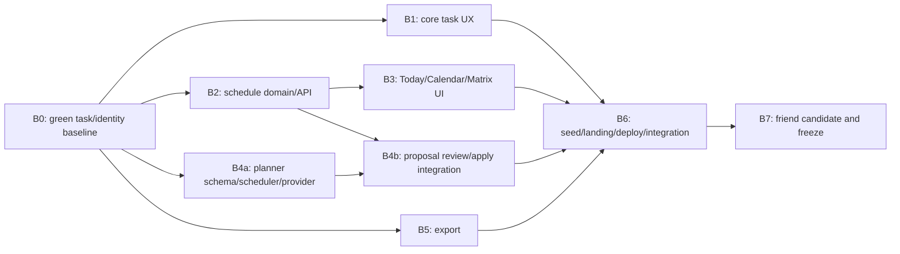

# Implementation plan

This is the dependency and delivery plan for the Deadline-safe Hackathon Core. Scope lives in `docs/SCOPE.md`; verification lives in `docs/QUALITY.md`. It is current truth, not a progress diary.

## Deadline contract

- Official deadline: **2026-07-22 08:00 GMT+8**.
- Hosted friend candidate: **2026-07-20 20:00 GMT+8**.
- Engineering freeze: **2026-07-21 08:00 GMT+8**.
- After freeze, only blocker/critical repairs, testing, recording, and submission work are allowed.
- Submit a complete draft by **2026-07-22 03:00 GMT+8**, retaining a five-hour contingency.

The first external deliverable is a friend-testable URL and test script. Internal feature breadth is not a substitute for that milestone.

## Active product boundary

The release includes identity/demo entry, the task/organization core, non-recurring schedules, Today/Upcoming, Calendar, Matrix, the GPT-5.6 proposal/review/apply flow, JSON export, landing/seed/deployment, and release evidence.

Do not implement recurrence, occurrence events, habits, Focus, reminders/push, service-worker caching, or PWA installability. Those are deferred extensions and require a new scope change after the friend-candidate gate.

## Parallel execution contract

Parallel work is organized by capability, not route. A route is a thin composition surface and cannot own domain, persistence, or authorization behavior.

### Isolation

- Every coding lane except the integration lane uses a separate Git worktree/thread from the same green checkpoint.
- One lane owns each mutable module surface. No two lanes edit the same source file.
- Workers commit coherent changes at least every 60–90 minutes and report the commit plus exact checks.
- Workers do not edit `package.json`, `pnpm-lock.yaml`, global schema aggregation, `drizzle/`, root route maps, shared tokens, deployment configuration, or canonical scope documents unless the integration owner assigns that exact file.
- The integration owner serializes migrations, dependency changes, route composition, shared files, cherry-picks, and conflict resolution.
- Full database, browser, Docker, and production gates run centrally and sequentially. Workers run focused tests/type/lint to avoid machine-resource contention.

### Integration cadence

1. Worker returns one reviewable commit and verification summary.
2. Integrator reviews scope/boundaries/security before cherry-pick.
3. Integrator runs the affected fast/module gate.
4. Integration branch is checkpointed every two to three hours when green.
5. A failing lane is repaired or dropped from the merge wave; it never blocks independent green commits.

No lane may hide a failing test, weaken a gate, or leave a large uncommitted batch for final integration.

## Workstream map

## B0 — Contract and green-baseline gate (maximum 3 hours)

### Deliverables

- Apply the five-part scope-change protocol across scope, goal, module, data, quality, design, hackathon, and implementation contracts.
- Stabilize the existing core-task presentation work into small reviewable commits.
- Remove dead controls/imports/tests that reference deferred features.
- Confirm repository status, branch, environment, PostgreSQL readiness, and deterministic seed baseline.

### Gate

- `pnpm format:check`
- `pnpm lint`
- `pnpm typecheck`
- focused task component/unit tests
- documentation link/reference audit for active/deferred terminology
- no deferred route/table/dependency/job exists in the active diff

No implementation worktree starts from an unreviewed dirty snapshot.

## B1 — Core task UX (maximum 6 hours, critical path)

### Boundary

Own only unscheduled task/list/section/tag/checklist/subtask presentation and its focused tests. Do not add schedule, AI, export, or deployment behavior.

### Deliverables

- Inbox, regular-list, Completed/Cancelled, and user-scoped search navigation.
- Quick add, task row, inspector/mobile details, organization, priority/tags, checklist/subtasks, Markdown, and command palette.
- Optimistic create/edit/complete/move/reorder, Undo, authoritative rollback, visible row-version conflict recovery, and pending-write safety.
- Pointer/touch/keyboard reorder plus visible Move alternatives.
- Default, empty, loading, recoverable error, offline, and permission states.

### Gate

- G1 focused component/API/E2E path.
- Conflict/network/offline/unauthorized variants.
- Task screen accessibility and responsive checks at 1440, 1024, and 390 px.
- Lint, typecheck, task tests, and design verification.

## B2 — Schedule domain and API (maximum 7 hours, may overlap B1 after B0)

### Boundary

Own `task_schedules` and schedule use cases/contracts only. No recurrence, occurrence, reminders, calendar presentation, or planner UI.

### Deliverables

- Reviewed schedule schema/migration with all-day versus timed discriminant constraints.
- Set/clear schedule commands with ownership, optimistic version, and one task-version increment.
- Bounded schedule reads for smart views and Calendar.
- English Chrono parsing that preserves source text and exposes editable suggestions.
- Explicit IANA timezone conversion helpers and DST fixtures.

### Gate

- Empty/upgrade migration and schema inventory.
- Cross-user schedule denial and stale-version tests.
- All-day exclusivity, timed round-trip, DST gap/fold, and parser fixtures.
- Lint, typecheck, domain/API/database tests.

Only the integration owner edits schema aggregation and generated SQL.

## B3 — Today, Calendar, and Matrix (maximum 8 hours, starts after B2 contract freeze)

### Boundary

Own planning projections and their presentation. Mutations call the public tasks schedule/status/priority services.

### Deliverables

- Today and Upcoming local-day task projections.
- Range-bounded month, week/day, and agenda Calendar views.
- Calendar drag/resize with rollback plus the canonical non-drag schedule form.
- Derived Eisenhower quadrants and accessible priority/schedule actions.
- Shared query truth: no duplicate task status, schedule, or quadrant persistence.
- Default, empty, loading, error, offline, permission, and conflict states.

### Gate

- G2 desktop/mobile E2E.
- Timezone/DST/range/Matrix boundary tests.
- Keyboard/touch schedule parity and visual/a11y checks.
- Query-plan/index review, lint, typecheck, module/database tests, and build.

## B4 — Reality-aware AI planner (maximum 10 hours, two merge waves)

### B4a: independent core

- Versioned Zod extraction/proposal schemas.
- Deterministic free-interval scheduler with buffer, fixed busy intervals, overflow, and repeatability.
- Server-only OpenAI Responses adapter using `gpt-5.6`, `store: false`, minimal selected context, timeout, and refusal/schema handling.
- Proposal persistence and capability state.

### B4b: integration after B2

- Describe, processing, Review, and Result states.
- Editable/deselectable create/update/prioritize/schedule/defer actions with before/after, rationale, uncertainty, conflict, and overflow.
- Explicit apply endpoint that reauthorizes/reloads, rejects stale/forbidden actions, and commits selected changes atomically/idempotently.
- No-key, refusal, timeout, malformed, stale, offline, and apply-failure recovery.

### Gate

- G3 fixtures/E2E and one separately recorded live smoke.
- No-write-before-apply, cross-user, stale, duplicate-apply, and atomic rollback tests.
- Minimal-context and redacted-log assertions.
- Lint, typecheck, assistant/planning/task integration tests, accessibility, responsive review, and build.

## B5 — JSON export (maximum 4 hours, independent after active DTO contracts freeze)

### Deliverables

- Versioned Zod envelope containing authorized identity preferences, active task/organization/schedule data, and structured planner proposals.
- Consistent read snapshot, stable IDs/relationships, explicit dates/instants/timezones, deterministic filename, and private/no-store response.
- No credentials, sessions, provider secrets, raw brain dump, server configuration, or cross-user data.

### Gate

- Two-user denial, schema/relationship validation, consistent-snapshot, serialization, headers, filename, and secret-redaction tests.
- No import route/parser/mutation.

## B6 — Landing, seed, integration, and hosted candidate (maximum 8 hours)

### Deliverables

- Original landing/onboarding and accurate Deadline-safe Core copy.
- Deterministic isolated demo seed/reset covering every G1–G4/video beat.
- Cross-module navigation/counts/error boundaries/responsive transitions.
- Production Docker build, migration/predeploy path, Railway web/PostgreSQL configuration, health probes, and hard cost controls.
- README/setup/provider/export/demo instructions and release CI.
- Friend handoff: URL, demo action, five-minute script, feedback template, known limitations, and candidate commit.

### Gate

- Fresh-clone install/migrate/seed/build rehearsal.
- Full G1–G4 once locally and once on hosted candidate.
- OpenAI-disabled, database-unavailable, offline-write, and seed-isolation disclosures.
- Production headers/cookies/cache/health/log-redaction smoke.
- `pnpm verify` before candidate designation.

## B7 — Engineering freeze and submission window

### July 20, 20:00–July 21, 08:00 GMT+8

- Collect friend/user feedback against G1–G4.
- Repair blocker/critical defects first and rerun affected gates.
- Finish responsive/accessibility/security/schema/dependency/license audits.
- Freeze active-scope feature work at July 21 08:00.

### July 21, 08:00–18:00

- User and friend test the frozen candidate.
- Accept only blocker/critical fixes; each fix gets focused regression plus affected golden paths.
- Capture approved screenshots and final known-limitations text.

### July 21, 18:00–July 22, 03:00

- Record and caption primary and backup demo takes.
- Complete description, architecture/GPT-5.6 explanation, repository, live URL, release commit, and `/feedback` identifier.
- Submit a complete draft and verify every public link in a clean browser.

### July 22, 03:00–08:00

- Five-hour contingency for upload/provider/submission-form failure.
- No change unless submission or the public critical path is blocked; any code change requires targeted verification and release-commit update.

## Traceability

| Active capability | Workstream | Primary evidence |
|---|---|---|
| Auth, preferences, first run | established baseline + B6 | identity integration + two-user denial + G1 |
| Organization/task lifecycle/search | B1 | domain/DB/API suites + G1 |
| Schedule/smart views/Calendar/Matrix | B2–B3 | time/range/Matrix suites + G2 |
| AI proposal/review/apply | B4 | eval/no-write/apply suites + G3 |
| Export | B5 | version/ownership integration + G4 |
| Demo/deployment/self-host | B6–B7 | fresh clone + production/hosted smoke + friend gate |

## Risk triggers

| Trigger | Required response |
|---|---|
| A lane misses two 90-minute checkpoints | stop it, preserve its last green commit, and reassign or simplify only within active acceptance criteria |
| Schedule contract changes after B3/B4 integration starts | integration owner pauses consumers, updates the contract once, then rebases/cherry-picks; consumers do not invent adapters independently |
| Browser/Docker resource pressure | stop concurrent heavy gates; keep coding worktrees active and run one centralized environment gate at a time |
| Hosted candidate unavailable by July 20 20:00 | prioritize local production demo plus deployment repair; do not start deferred features or cosmetic work |
| Any deferred feature appears in code/copy/schema | remove it before the next merge; time spent is not a reason to retain it |
| OpenAI live provider fails | preserve fixture-driven G3, disclose provider limitation, and keep manual task/calendar core fully usable |

## Plan completion

The plan is complete only when `docs/GOAL.md` and the friend-candidate/final gates in `docs/QUALITY.md` are satisfied. Finishing a timebox, exhausting agent capacity, or recording a demo does not override failed active-scope evidence.
