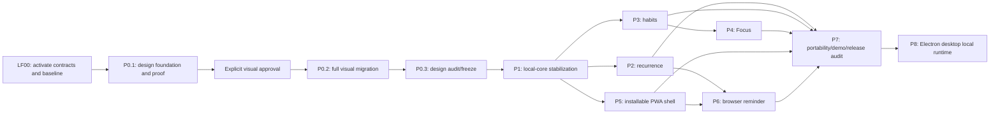

# Local-first Full Release implementation plan

This is the canonical dependency and delivery plan for the active release in `docs/SCOPE.md`.
Verification lives in `docs/QUALITY.md`. It replaces the completed/obsolete B0–B7 hackathon build
sequence; Git retains that history.

## Deadline and candidate-safety contract

- Official hackathon deadline: **2026-07-22 08:00 GMT+8**.
- The last fully green Deadline-safe Core remains the submission fallback while this plan runs on an
  isolated branch/worktree.
- A package may replace that fallback only after its complete gate passes. Screenshots, elapsed time,
  or a partially working feature are not merge criteria.
- P0 visual proof requires explicit user approval. If approval is pending, agents may perform
  read-only audits or the specifically independent P1 diagnostic work; silence never authorizes the
  broad design rollout.
- If no new package is fully green before submission preparation must begin, ship/test/record the
  stable core rather than a mixed design or partial feature.

The full plan is much larger than the remaining hackathon window. Estimated implementation is
**176–272 serial engineering hours**, or roughly **88–125 elapsed hours** with four carefully
partitioned agents, excluding user-approval and external-provider latency. Overnight work can make
meaningful progress but cannot make this entire contract deadline-safe. No estimate weakens a gate.

## Release dependency graph

P2, P3, and P5 may run in parallel only after P1 freezes their public contracts. P4 may begin pure
domain work after the Habits ownership-validator contract freezes. P6 waits for recurrence and the
service-worker contract. Each P2-P6 package supplies and integrates its portable representation;
the integration owner serializes export-schema version bumps as packages land. P7 owns the final
cross-version audit, demo, documentation, and cross-module evidence, not the first export integration.

## Parallel execution contract

Parallel work is split by capability/layer ownership, never merely by route.

### Integration-owner files

Only the integration owner edits or serializes:

- canonical scope/goal/plan/architecture/quality documents;
- `package.json`, `pnpm-lock.yaml`, shared environment configuration, and license allowlists;
- shared design tokens until P0 foundation freeze, root shell/navigation, and root route maps;
- global Drizzle schema aggregation and generated `drizzle/*` migrations;
- worker composition, export schema version, demo reset composition, Docker/CI/release configuration;
- full database, browser, service-worker, worker, Docker, and `pnpm verify` gates.

### Worker rules

- Each lane starts from the same green checkpoint in an isolated worktree/thread and owns an explicit
  non-overlapping file list.
- Pure domain/application/test work may run before a serialized migration only when the public
  contract is frozen and no dormant production export is exposed.
- A lane returns a coherent commit plus exact focused checks. The integration owner audits scope,
  boundaries, schema, ownership, security, and dead code before integration.
- No worker silently edits shared tokens, dependency files, global schemas, migrations, route maps,
  or canonical contracts.
- Browser/Docker/database/full gates run centrally and sequentially to avoid shared-state and machine
  resource conflicts.

## LF00 — Activate contracts and protect the green baseline (2–4 hours, serial)

### Boundary

Planning and current-truth repair only. Do not add product code, dependency, route, table, or control.

### Deliverables

- Apply the five-part user-authorized scope change across `AGENTS.md`, scope, goal, plan,
  architecture, stack, data, module, design, quality, setup, and manifest contracts.
- Promote only P0–P8. Keep Stage A–D explicit and non-active.
- Define local/self-host completion and remove hosted deployment as a goal prerequisite without
  deleting optional deployment guidance.
- Preserve the current green candidate as the rollback/submission fallback and confirm repository,
  Node/pnpm, PostgreSQL, migrations, demo entry, and provider-absent baseline.
- Inventory exact tables/routes/dependencies before later schema changes.

### Gate

- No contradictory active/deferred/zero-job/hosted-prerequisite wording in current-truth docs.
- Documentation links and manifest routing resolve; no status diary was added.
- `pnpm format:check`, `pnpm lint`, `pnpm typecheck`, `pnpm check:design`, and existing focused core
  tests pass; run `pnpm verify` when PostgreSQL/browser prerequisites are available.
- No P0–P8 production implementation appears in the LF00 diff.

## P0 — Editorial Focus visual-system migration (24–40 serial hours; 14–22 elapsed)

### Boundary

Presentation/design only for the already-working core. Preserve every route, workflow, state,
authorization rule, API, data model, module boundary, and information architecture. Follow the
pinned research source through the application contract in `docs/design/editorial-focus.md`.

### P0.1 — Foundation and five-screen proof (8–12 hours; then stop)

Deliverables:

- Capture the current Landing, Today, Calendar, task-detail, and populated AI Review baselines before
  changing executable tokens.
- Finalize original light/dark semantic tokens, contrast pairs, type scale, density, radii,
  elevation, focus, and motion in docs, CSS, and computed design tests together.
- Self-host the GetDesign-recommended, reviewed OFL-licensed EB Garamond Variable substitute for
  display moments and Inter Variable for working UI through `next/font/local`; use only the font's
  genuine 400–800 axis, commit font licenses, and add no font runtime dependency.
- Update shared tokens/primitives first. Target task titles near 15/22 px and comfortable two-line
  rows near 64 px while preserving 36 px fine-pointer controls and 44 px touch targets.
- Implement only the five real proof surfaces with deterministic demo/fixture data. Keep serif and
  atmosphere out of dense task/calendar/form content.
- Capture 1440 and 390 light proofs, representative dark proofs, and 768/320 boundary evidence. AI
  Review mobile evidence must show both populated proposal content and sticky Apply controls.
- Present current/new comparison evidence and stop for explicit user approval.

Gate:

- `pnpm check:design`, focused proof component tests, `pnpm verify:design`, affected Playwright proof
  and fixture paths, `pnpm test:a11y`, `pnpm verify:quick`, and `pnpm build`.
- Manual contrast, keyboard, route-focus, reduced-motion, 200% zoom, font-load determinism, and
  responsive overflow review.
- Diff proves no behavior/API/schema/route change and no copied branding, asset, copy, palette,
  layout, audio motif, proprietary font, or trade dress.
- **Explicit user screenshot approval.** P0.2 cannot start without it.

### P0.2 — Approved full-screen migration (12–20 serial hours)

After the shared foundation freezes, run three non-overlapping presentation lanes:

1. Landing, authentication, Settings, loading/offline surfaces, and responsive shell.
2. Task navigation, rows, quick add, details, editors, overlays, dialogs, and every task state.
3. Today/Upcoming, Calendar, Matrix, and planner Describe/Processing/Review/Result states.

Each lane preserves behavior tests and covers light/dark/system plus default, empty, loading, error,
offline, permission, provider, and conflict states. No lane changes shared tokens without
integration-owner review.

### P0.3 — Integration audit and design freeze (4–8 hours)

- Inspect every route at 1440, 1024, 768, 390, and 320 CSS px, plus coarse pointer, reduced motion,
  200% zoom, keyboard-only paths, focus entry/return, and light/dark/system themes.
- Run `pnpm verify:design`, affected G1–G4 paths, `pnpm test:a11y`, `pnpm build`, then `pnpm verify`.
- Audit that task text is measurably less cramped, operational density remains usable, and no mixed
  old/new component hierarchy remains.
- Obtain final migrated screenshot approval before feature UI starts.

## P1 — Local-core stabilization (10–16 serial hours; 7–10 elapsed)

### Boundary

Close audited gaps in existing behavior only. No recurrence, habit, Focus, PWA, reminder, or later
schema/control may appear.

### Deliverables

- Context-aware quick add defaults exactly to current Inbox/current regular list unscheduled, Today
  all-day today, or Upcoming all-day on the next local day. A visible editable recognized date/time
  may override the default; Calendar uses the full create/schedule form and Matrix uses only the
  global palette.
- One atomic create-with-schedule application use case and endpoint; no orphan task on schedule
  validation/conflict/network failure.
- Canonical authorized task inspector/detail access from Today, Upcoming, Calendar, Matrix, search,
  and planner result contexts.
- Correct query invalidation after task/schedule/planner apply and local-midnight/timezone refresh for
  Today/Upcoming/Matrix without full browser restart.
- Restore planner Review/Result from persisted proposal state after refresh/navigation; never infer
  a proposal from client-only state.
- Show accurate optional OpenAI capability in Settings and retain clear no-key/manual paths.
- Harden supported local origin/CSRF configuration and document both `127.0.0.1` and `localhost`
  without wildcard trust.
- Repair stale local feature/setup claims and preserve user input across offline/error/conflict paths.

### Gate

- Focused domain/application/component/API/database tests for atomicity, ownership, idempotency,
  stale versions, midnight/timezone changes, query freshness, and origin policy.
- G1–G4 and forced variants at desktop/mobile, no-key workflow, affected a11y/design checks.
- `pnpm verify`; no extension table/dependency/route/control exists.

## P2 — Bounded schedule-based recurrence (24–36 serial hours; 14–20 elapsed)

### Boundary

`modules/tasks` owns rules/events and task mutations; `modules/planning` consumes bounded public
occurrence projections. No generated task clones, second status/schedule fact, reminder behavior, or
AI-created recurrence.

### Deliverables

- Promote reviewed `rrule` dependency, domain wrapper, canonical presets, and safety caps.
- Add `task_recurrences` and `task_occurrence_events` through one reviewed migration with tenant-
  leading ownership, checked date/instant cutovers, immutable post-command `task_version` ordering,
  constraints, indexes, upgrade tests, and no generic JSON.
- One schedule-anchored rule for an eligible scheduled root task: daily, weekdays, weekly selected
  weekdays, monthly day-of-month, or yearly month/day, bounded interval, and never/until/count end.
- Store a checked all-day/date or timed/instant projection cutover on the single mutable rule. Initial
  projection begins at the schedule anchor; rule/schedule edits choose a server-controlled future
  cutover, preserve recorded earlier events, and do not claim to reconstruct unrecorded pre-cutover
  occurrences.
- Deterministic `occurrence_key`, range-bounded all-day/timed expansion, DST/month/year behavior, and
  projection into Today, Upcoming, Calendar, agenda, and Matrix.
- Complete, skip, and undo/reopen one occurrence without completing the series; edit/end future
  expansion while preserving past occurrence events.
- Task-detail/row occurrence labels and accessible series/occurrence actions; planner treats bounded
  recurring busy intervals as context but cannot create/edit recurrence.
- Recurrence demo fixture plus an integrated, version-bumped portable recurrence/event section before
  the P2 gate; the integration owner serializes the shared export schema.
- Before migration generation, freeze exact preset interval/count/computation bounds and the missing-
  month-day/leap-day policy in the task/domain/data contracts. No migration or UI may invent a bound
  independently.

### Explicit exclusions

Completion-relative rules, raw RRULE entry, individual occurrence reschedule/content edit, “this and
future” forks, exclusion-date editor, recurring checklist/subtask state, and arbitrary custom
cadence remain Stage A.

### Gate

- Preset/Zod/domain/DB constraint, ownership, optimistic conflict, and concurrency tests.
- Deterministic cap/range/occurrence-key, DST gap/fold, month-end, leap-day, edit/end, complete/skip/
  undo, and no-duplicate fixtures.
- Desktop/mobile recurrence golden path, keyboard schedule parity, responsive/a11y/design evidence.
- Empty and upgrade migration, query-plan/index review, `pnpm verify`.

## P3 — Habits (22–34 serial hours; 13–19 elapsed)

### Boundary

`modules/habits` owns definitions, schedules, local-day logs, and derived projections. No task,
Focus, reminder, social, achievement, or health behavior is hidden inside it.

### Deliverables

- Promote `habits`, `habit_schedules`, and `habit_logs` through one reviewed migration and narrow
  public application contracts.
- Create/edit/archive/restore boolean or numeric habits with daily, selected-weekday, or target-per-
  week schedules in an IANA timezone.
- Today check-in, quantity/note edit, undo, skip, and unachieved with one effective log per local day.
- Freeze ISO Monday-Sunday weekly-target behavior: show every in-range day until achieved; count each
  successful day once; keep a below-target current week in progress; fail it only after Sunday;
  preserve edit/undo after achievement without presenting more required work.
- Derived current/best streaks, seven-day strip, and compact monthly heat-map data; never store
  counters.
- Responsive Habits list/detail/create UI and Today integration with default, empty, loading, error,
  offline, permission, and conflict states.
- Integrated, version-bumped portable habit section and deterministic demo fixture before the P3
  gate; the integration owner serializes the shared export schema.
- Before migration generation, freeze exact title/icon/unit/note/value/quantity/weekly-target bounds
  in the module and data contracts so Zod, domain, PostgreSQL, and form copy share one definition.

### Gate

- Goal/schedule discriminant and DB constraints; cross-user and same-day concurrent-write denial.
- Daily/weekday/weekly-target, DST/week-boundary, quantity, edit/undo/skip/unachieved, archive/restore,
  Today, streak, and heat-map fixtures.
- Desktop/mobile Habits golden path; keyboard/screen-reader heat-map, responsive/design/a11y checks.
- Empty and upgrade migration, `pnpm verify`.

## P4 — Focus (18–26 serial hours; 11–15 elapsed)

### Boundary

`modules/focus` owns authoritative timer/session state and derived totals. It consumes narrow task and
habit ownership/link validators only. Client ticks never own persisted time.

### Deliverables

- Promote `focus_sessions` with checked `kind=focus|break` through one reviewed migration and a
  partial unique one-active-session invariant across both kinds.
- Pomodoro/stopwatch focus and explicit break start/pause/resume/finish/discard. Focus rows may link
  to one owned task or habit; break rows link to neither and never contribute to focus totals.
- Reconstruct active state from server timestamps/accumulated seconds after refresh/reconnect;
  Pomodoro breaks never contribute to stored focus time.
- Correct/delete completed sessions, today/seven-day totals, and recent history.
- Responsive Focus route with idle/running/paused/break/reconnect/loading/error/offline/permission/
  conflict states and screen-reader announcements only at meaningful transitions.
- Integrated, version-bumped portable completed-focus section (excluding break rows) and deterministic
  demo fixture before the P4 gate; the integration owner serializes the shared export schema.
- Before migration generation, freeze focus/break/correction/duration limits in the module and data
  contracts; client timer defaults cannot become database policy by accident.

### Gate

- Pure state-machine/idempotency tests with injected clock; hostile-clock/reconnect fixtures.
- DB race proving one active/paused session and cross-user task/habit/session denial.
- Pause accumulation, finish/discard, break exclusion, correction/deletion, summary-window, and
  historical-link tests.
- Desktop/mobile Focus golden path, reduced motion, tabular numeral, a11y/design checks.
- Empty and upgrade migration, `pnpm verify`.

## P5 — Installable PWA shell with honest offline fallback (10–16 serial hours)

### Boundary

Installability and static shell resilience only. Do not persist authenticated API/user content in
Cache Storage, add IndexedDB domain data, accept offline writes, register background sync, or imply
offline-first behavior.

### Deliverables

- Original maskable/standard icons, manifest metadata, standalone display, scope/start URL, theme
  metadata, and install guidance where supported.
- A small versioned service worker caching only fingerprinted public/static assets and a dedicated
  content-free offline fallback; explicit activate/update/reload and old-cache cleanup behavior.
- Preserve already rendered content read-only when connectivity drops, disable all domain writes,
  and recover cleanly online.
- Clear capability/error/update UI and service-worker registration isolated behind a presentation
  adapter; no second UI framework or speculative native layer.
- Serialize the P5 export-schema version step through the integration owner while deliberately adding
  no PWA/device/cache data section; add a regression test proving those operational details are not
  portable.

### Gate

- Manifest/icon/scope/installability audit; cold offline fallback and online recovery.
- Cache inventory proves no authenticated HTML/API, task/planner/export, provider, mutation, or
  secret-bearing response is stored.
- Upgrade/old-cache cleanup and corrupted/missing-cache recovery tests.
- Standalone desktop/mobile responsive/a11y/offline-write-denial paths and `pnpm verify`.

## P6 — One browser-push task reminder and active worker (24–36 serial hours; 14–20 elapsed)

### Boundary

`modules/notifications` owns one task reminder, subscriptions, deliveries, provider adapter, and
worker use cases. Tasks own schedules/recurrence/status; P6 consumes their frozen public events and
snapshots. Core startup stays useful without browser support, VAPID, or a running worker.

### Deliverables

- Review/install `web-push`; add `task_reminders`, `push_subscriptions`, and
  `notification_deliveries` through one reviewed migration.
- Explicit-user-action subscription/permission enrollment and revocation; encrypted endpoint/key
  material with key-version metadata and safe capability/degraded states.
- Zero/one task reminder: absolute instant only for a non-recurring task, or relative to an eligible
  task start. Recurring tasks require relative-start and enqueue only the next eligible occurrence.
- Transactional reconciliation when schedule, recurrence, status, deletion, or reminder changes;
  deterministic logical delivery idempotency.
- Active pg-boss worker delivery, bounded retry/backoff, permanent subscription revocation, stale/
  completed/deleted/rescheduled/disabled no-op, cleanup retention, and notification click-through.
- Generic privacy-safe notification copy; queue/log/export/client payloads contain no task content,
  endpoints, or key material.
- Integrate and version-bump the portable reminder-specification export before the P6 gate; exclude
  subscriptions, deliveries, queue state, and provider/encryption material.
- Report configured, unconfigured, and known-disabled worker states without inventing a heartbeat.
  When configuration expects a worker, UI says runtime liveness is not verified; operator evidence is
  the worker check plus readiness log.
- Before migration generation, freeze relative-offset semantics/range, delivery states, retry/backoff,
  stale-delivery cutoff, and retention constants in the module/data/worker contracts. Each delivery
  targets one subscription so partial multi-device provider results never share one mutable state.

### Gate

- Reminder discriminant/eligibility, ownership/version, encryption/redaction, and migration tests.
- Transactional enqueue, duplicate execution, recurrence/DST next-occurrence, stale no-op,
  transient/permanent provider, cleanup, and worker-disabled degradation fixtures.
- Service-worker push/click E2E and one configured local browser-push smoke when the user supplies
  VAPID keys and grants permission; exact external blocker reported otherwise.
- Worker/process/signal/health, responsive/a11y/design, `pnpm verify`.

## P7 — Portability, deterministic demo, and release audit (16–24 serial hours)

### Deliverables

- Audit the serial export-schema versions already integrated by P2-P6 and validate the final combined
  document containing recurrence rules/events, habits/schedules/logs, completed focus history, and
  portable reminder definitions.
- Exclude push subscriptions, endpoint keys, delivery/queue internals, credentials, provider secrets,
  raw planner input, and server configuration.
- Extend isolated deterministic demo reset across every released package without pre-granting push
  permission or requiring OpenAI/VAPID.
- Update README/setup/worker/PWA/VAPID/export/security/friend-test/submission guidance; hosted
  deployment remains optional.
- Rehearse fresh clone, empty and upgrade migrations, local production web/PostgreSQL/active worker,
  demo reset, all golden paths, export, provider-degraded paths, and clean shutdown.
- Produce approved screenshots, under-three-minute demo script, architecture/provider explanation,
  known limitations, and final acceptance evidence.

### Gate

- Version/relationship/two-user/consistent-snapshot/secret-redaction export tests.
- All core and extension golden paths at required desktop/mobile widths.
- All mandatory scope, architecture, schema, auth, security/privacy/logging, time, AI, recurrence,
  habits, Focus, PWA, push/worker, accessibility, responsive, dependency/license, secret, production,
  and dead-code audits in `docs/QUALITY.md`.
- `pnpm verify:design`, `pnpm verify`, production Compose smoke, and exact final diff review.

## P8 — Electron desktop local runtime and installer audit (20–32 serial hours)

### Deliverables

- Electron main/preload process with context isolation, sandboxed renderer, single-instance locking,
  trusted-origin navigation, and graceful child-process shutdown.
- Development command using the existing Docker PostgreSQL path and production command using the
  verified Next standalone Webpack output, staged target-specific Node 24 and complete relocatable
  PostgreSQL 17 runtime trees, and `electron-builder`.
- Per-user runtime directory, stable instance secret, loopback random port, first-run database
  initialization, committed migration execution, readiness wait, and upgrade behavior.
- Windows NSIS and macOS DMG configuration for x64/arm64 targets, plus runtime source/version,
  checksum/license inventory and signing/notarization release instructions.
- Clean-machine/offline/manual-core/AI-degraded/second-instance/child-shutdown smoke evidence for
  every shipped target. No remote sync or second application/database implementation.

### Dependencies and risk

- Depends on the existing Next standalone build, migration script, identity configuration, and P7
  release/export contracts. It does not add tables or change domain/application ownership.
- Native PostgreSQL distribution source, platform signing credentials, and cross-platform build
  agents are external release inputs. They must be selected and recorded before a production installer
  is designated valid.
- AI key setup for packaged users remains a product decision: environment injection is sufficient for
  development, but a production settings/keychain flow is required if end users must configure a key
  without editing files.

### Gate

- `tsc -p tsconfig.electron.json`, lint, standalone Next build, runtime-artifact check, unpacked
  Electron launch, clean-machine target smoke, migration upgrade, process shutdown, and installer
  signing/notarization evidence all pass. Missing binaries or an unverified build is a blocker, not a
  documented success.

## Traceability

| Active capability | Package | Primary evidence |
|---|---|---|
| Editorial Focus | P0 | approved proof/final screenshots + design/a11y gates |
| Existing identity/tasks/planning/AI | P1 | G1–G4 + authorization/atomicity/freshness tests |
| Recurrence/occurrences | P2 | recurrence golden path + range/DST/ownership suites |
| Habits | P3 | Habits golden path + log/streak/time suites |
| Focus | P4 | Focus golden path + state/race/clock suites |
| Installable shell | P5 | manifest/cache/offline fallback audit |
| Browser reminder/worker | P6 | reminder/push golden path + idempotency/provider suites |
| Export/demo/local release | P7 | expanded export + fresh-clone/Compose/full audit |
| Electron desktop local runtime | P8 | G10 + clean-machine/offline/upgrade/runtime/signing audit |

## Risk and cut rules

| Trigger | Required response |
|---|---|
| Visual proof awaits approval | stop dependent styling; continue only read-only audits or listed P1 diagnostics |
| A lane misses two 90-minute checkpoints | preserve its last green commit, stop the lane, and reassign or reassess; do not hide partial code |
| Shared contract/schema changes after consumers start | integration owner freezes consumers, updates the contract once, then rebases; consumers do not invent adapters |
| Browser/Docker resource pressure | keep coding lanes active but run heavy environment gates centrally and one at a time |
| New package is not fully green before submission work | retain the stable core candidate; do not merge a partial redesign/feature |
| External OpenAI/VAPID/browser permission is absent | keep fixture/provider-degraded paths green and report the exact manual smoke blocker |
| Native runtime source/checksum/license or signing input is unresolved | do not designate an installer production-ready; keep the unpacked development/runtime work isolated |
| Desktop AI key configuration is not implemented | document environment-only development access; do not claim packaged-user key management is complete |
| Time pressure suggests a feature cut | request user approval for whole packages in reverse dependency order; update all five scope-change surfaces |
| Later-scope code/control/table/dependency appears | remove it before integration regardless of time already spent |

Never cut authorization isolation, manual core behavior, review-before-apply AI, migration integrity,
export privacy, or required audits to make room for an extension. P0 is coherent or it does not
replace the existing coherent design.

## Plan completion

This plan is complete only when `docs/GOAL.md`, every active acceptance criterion, and the final P8
gate are satisfied. A timebox, overnight run, deadline, screenshot, agent count, or unavailable
external provider cannot convert skipped or failing evidence into completion.
