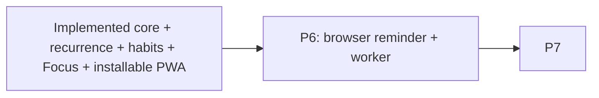

# Local-first Full Release forward plan

This is the canonical dependency and delivery plan for the unfinished P6-P7 work in
`docs/SCOPE.md`. The implemented and approved baseline is summarized in `README.md`; completed
sequencing exists only in Git. Verification lives in `docs/QUALITY.md`.

## Execution baseline

- `main` stays a green, locally runnable baseline while a later package is incomplete.
- Editorial Focus is frozen across current routes. Later UI extends it through `DESIGN.md`; broad
  restyling or shared-foundation changes require explicit user approval and new visual evidence.
- P6 is the next active package in numbered execution order. No package may expose a table, route,
  dependency, worker job, service worker, or control before its own gate.
- A package integrates only as a coherent unit after its acceptance and audit gates pass. A partial
  implementation, screenshot, elapsed time, or available agent is not a merge criterion.
- The remaining work is estimated at **40-60 serial engineering hours** before external-provider
  and user-approval latency. Estimates guide coordination; they never weaken a gate or authorize a
  scope cut.
- Hackathon timing and submission operations live in `docs/HACKATHON.md`, not in this product plan.

## Remaining dependency graph

P6 builds on the implemented PWA service-worker boundary and satisfied recurrence dependency. P6
supplies and integrates its portable representation, and the integration owner serializes that
export-schema version bump. P7 owns the final cross-version audit, demo, documentation, and
cross-module evidence, not the first export integration.

## Parallel execution contract

Parallel work is split by capability and layer ownership, never merely by route.

### Integration-owner files

Only the integration owner edits or serializes:

- canonical scope, goal, plan, architecture, data, stack, design, and quality contracts;
- `package.json`, `pnpm-lock.yaml`, shared environment configuration, and license allowlists;
- shared design tokens, root shell/navigation, and root route maps;
- global Drizzle schema aggregation and generated `drizzle/*` migrations;
- worker composition, export schema version, demo reset composition, Docker/CI/release configuration;
- full database, browser, service-worker, worker, Docker, and `pnpm verify` gates.

### Worker rules

- Each lane starts from the same green checkpoint in an isolated worktree/task and owns an explicit
  non-overlapping file list.
- Pure domain/application/test work may run before a serialized migration only when the public
  contract is frozen and no dormant production export is exposed.
- A lane returns a coherent commit plus exact focused checks. The integration owner audits scope,
  boundaries, schema, ownership, security, and dead code before integration.
- No worker silently edits shared tokens, dependency files, global schemas, migrations, route maps,
  or canonical contracts.
- Browser, Docker, database, and full gates run centrally and sequentially to avoid shared-state and
  machine-resource conflicts. Static lanes may run concurrently because repository checks must not
  create lint-visible temporary source files.

## P6 — One browser-push task reminder and active worker (24–36 serial hours; 14–20 elapsed)

### Boundary

`modules/notifications` owns one task reminder, subscriptions, deliveries, provider adapter, and
worker use cases. Tasks own schedules/recurrence/status; P6 consumes their frozen public events and
snapshots. Core startup stays useful without browser support, VAPID, or a running worker.

### Deliverables

- Review/install `web-push`; add `task_reminders`, `push_subscriptions`, and
  `notification_deliveries` through one reviewed migration.
- Explicit-user-action subscription/permission enrollment and revocation; encrypted endpoint/key
  material with key-version metadata and safe capability/degraded states.
- Zero/one task reminder: absolute instant only for a non-recurring task, or relative to an eligible
  task start. Recurring tasks require relative-start and enqueue only the next eligible occurrence.
- Transactional reconciliation when schedule, recurrence, status, deletion, or reminder changes;
  deterministic logical delivery idempotency.
- Active pg-boss worker delivery, bounded retry/backoff, permanent subscription revocation, stale/
  completed/deleted/rescheduled/disabled no-op, cleanup retention, and notification click-through.
- Generic privacy-safe notification copy; queue/log/export/client payloads contain no task content,
  endpoints, or key material.
- Integrate and version-bump the portable reminder-specification export before the P6 gate; exclude
  subscriptions, deliveries, queue state, and provider/encryption material.
- Report configured, unconfigured, and known-disabled worker states without inventing a heartbeat.
  When configuration expects a worker, UI says runtime liveness is not verified; operator evidence is
  the worker check plus readiness log.
- Before migration generation, freeze relative-offset semantics/range, delivery states, retry/backoff,
  stale-delivery cutoff, and retention constants in the module/data/worker contracts. Each delivery
  targets one subscription so partial multi-device provider results never share one mutable state.

### Gate

- Reminder discriminant/eligibility, ownership/version, encryption/redaction, and migration tests.
- Transactional enqueue, duplicate execution, recurrence/DST next-occurrence, stale no-op,
  transient/permanent provider, cleanup, and worker-disabled degradation fixtures.
- Service-worker push/click E2E and one configured local browser-push smoke when the user supplies
  VAPID keys and grants permission; exact external blocker reported otherwise.
- Worker/process/signal/health, responsive/a11y/design, `pnpm verify`.

## P7 — Portability, deterministic demo, and release audit (16–24 serial hours)

### Deliverables

- Audit the export-schema versions already integrated for recurrence, habits, Focus, and reminders,
  then validate the final combined document containing recurrence rules/events,
  habits/schedules/logs, completed focus history, and portable reminder definitions.
- Exclude push subscriptions, endpoint keys, delivery/queue internals, credentials, provider secrets,
  raw planner input, and server configuration.
- Extend isolated deterministic demo reset across every released package without pre-granting push
  permission or requiring OpenAI/VAPID.
- Update README/setup/worker/PWA/VAPID/export/security/friend-test/submission guidance; hosted
  deployment remains optional.
- Rehearse fresh clone, empty and upgrade migrations, local production web/PostgreSQL/active worker,
  demo reset, all golden paths, export, provider-degraded paths, and clean shutdown.
- Produce approved screenshots, under-three-minute demo script, architecture/provider explanation,
  known limitations, and final acceptance evidence.

### Gate

- Version/relationship/two-user/consistent-snapshot/secret-redaction export tests.
- All core and extension golden paths at required desktop/mobile widths.
- All mandatory scope, architecture, schema, auth, security/privacy/logging, time, AI, recurrence,
  habits, Focus, PWA, push/worker, accessibility, responsive, dependency/license, secret, production,
  and dead-code audits in `docs/QUALITY.md`.
- `pnpm verify:design`, `pnpm verify`, production Compose smoke, and exact final diff review.

## Traceability

| Active capability | Package | Primary evidence |
|---|---|---|
| Existing identity/tasks/planning/AI/recurrence/habits/Focus/installable shell | Implemented baseline | G1–G7 + install/cache/fallback/privacy/offline-write suites |
| Browser reminder/worker | P6 | reminder/push golden path + idempotency/provider suites |
| Export/demo/local release | P7 | expanded export + fresh-clone/Compose/full audit |

## Risk and cut rules

| Trigger | Required response |
|---|---|
| A package proposes a broad visual-system change | stop dependent styling and obtain explicit approval with fresh visual evidence |
| A lane misses two 90-minute checkpoints | preserve its last green commit, stop the lane, and reassign or reassess; do not hide partial code |
| Shared contract/schema changes after consumers start | integration owner freezes consumers, updates the contract once, then rebases; consumers do not invent adapters |
| Browser/Docker resource pressure | keep coding lanes active but run heavy environment gates centrally and one at a time |
| New package is not fully green before submission work | retain the implemented baseline; do not merge a partial feature |
| External OpenAI/VAPID/browser permission is absent | keep fixture/provider-degraded paths green and report the exact manual smoke blocker |
| Time pressure suggests a feature cut | request user approval for whole packages in reverse dependency order; update all five scope-change surfaces |
| Later-scope code/control/table/dependency appears | remove it before integration regardless of time already spent |

Never cut authorization isolation, manual core behavior, review-before-apply AI, migration integrity,
export privacy, or required audits to make room for an extension. Each package is coherent or it
does not replace the implemented baseline.

## Plan completion

This plan is complete only when `docs/GOAL.md`, every active acceptance criterion, and the final P7
gate are satisfied. A timebox, overnight run, deadline, screenshot, agent count, or unavailable
external provider cannot convert skipped or failing evidence into completion.
